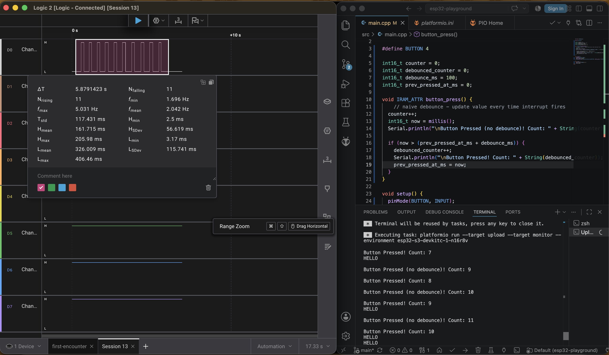

# esp32-playground

A bunch of learning projects using ESP32-S3-N16R8 developemt board.

- [User Guide](https://github.com/microrobotics/ESP32-S3-N16R8/blob/main/ESP32-S3-N16R8_User_Guide.pdf);
- [Schematic](https://99tech.com.au/mx-m/esp32/esp32-s3-yd_schematics.pdf);
- [ESP32-S3-WROOM-1 Datasheet](https://documentation.espressif.com/esp32-s3-wroom-1_wroom-1u_datasheet_en.pdf);
- [Pinout](https://lastminuteengineers.com/wp-content/uploads/iot/ESP32-S3-DevKitC-Pinout.png);

## Lesson 16

This lesson is about button press bouncing in electronics.

Every time a putton is physically pressed, it can generate noise, resulting in multiple on-off events during a single real button press. To fight it, debouncing is used.

Lesson assignment came along with this code:

```cpp
#include <Arduino.h>

#define BUTTON_LEFT 15
#define BUTTON_RIGHT 3

int16_t counter_left = 0;
int16_t counter_right = 0;

void IRAM_ATTR reaction_left() {
  counter_left++;
  Serial.println("\nLEFT Button Pressed! Count: " + String(counter_left));
}

void IRAM_ATTR reaction_right() {
  counter_right++;
  Serial.println("\nRIGHT Button Pressed! Count: " + String(counter_right));
}

void setup() {
  pinMode(BUTTON_LEFT, INPUT);
  pinMode(BUTTON_RIGHT, INPUT);
  Serial.begin(115200);
  attachInterrupt(digitalPinToInterrupt(BUTTON_LEFT), reaction_left, FALLING);
  attachInterrupt(digitalPinToInterrupt(BUTTON_RIGHT), reaction_right, FALLING);
}

void loop() {
  Serial.print("HELLO");
  delay(250);
}
```

It reacts to button presses using interrupts, and this approach is prone to button bouncing. `src/main.cpp` presents an updated version of this code.

Circuit:


Runtime behaviour:



During runtime, logic analyzer detected 11 button presses, and "naive" interrupts registered 11 events. However, only 10 physical presses happened, and this is what debounced interrupts registered.