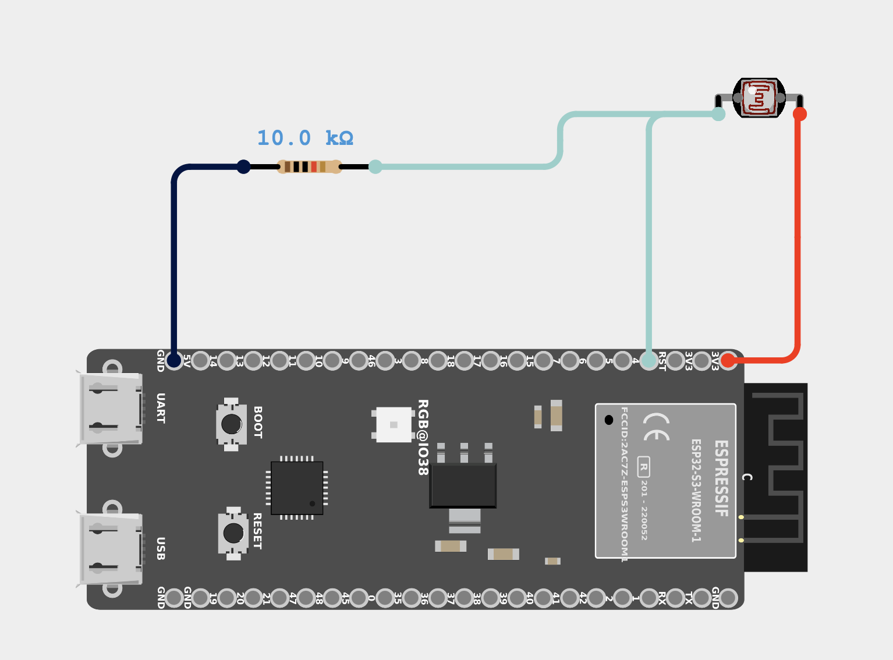
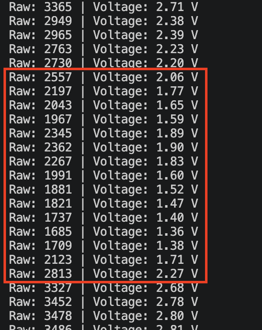
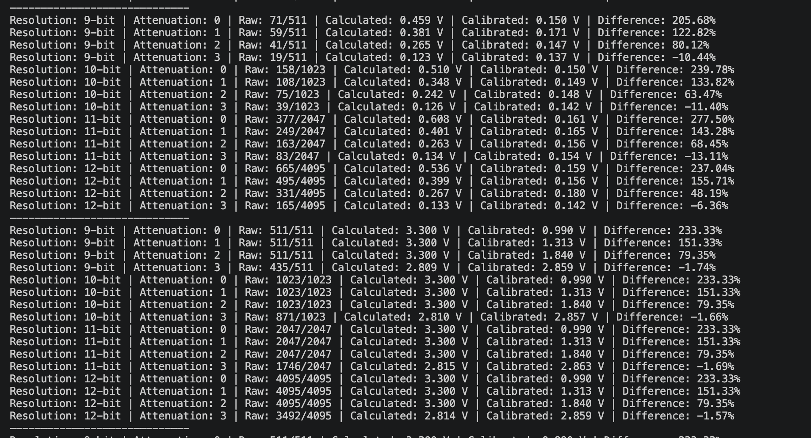

# esp32-playground

A bunch of learning projects using ESP32-S3-N16R8 developemt board.

- [User Guide](https://github.com/microrobotics/ESP32-S3-N16R8/blob/main/ESP32-S3-N16R8_User_Guide.pdf);
- [Schematic](https://99tech.com.au/mx-m/esp32/esp32-s3-yd_schematics.pdf);
- [ESP32-S3-WROOM-1 Datasheet](https://documentation.espressif.com/esp32-s3-wroom-1_wroom-1u_datasheet_en.pdf);
- [Pinout](https://lastminuteengineers.com/wp-content/uploads/iot/ESP32-S3-DevKitC-Pinout.png);

## Lesson 17 - light-dependent resistors and ADC

Tasks:

1. Attach LDR to ESP32-S3 as a voltage separator:

2. Read ADC every 100ms. Calculate voltage by hand and using `analogReadMillivolts`:

3. Extra task:
- Change ADC resolution (9, 10, 11, 12 bit);
- Change ADC attenuation using `analogSetPinAttenuation`;
- For each combination, calculate a realistic range of measurement, stability and deviation:
;

On the image above, the first measurement happened in dim environment and the second measurement happened in bright environment. Two types of measurements happened - a manual calculation using analogRead and formula, and a `analogReadMilliVolts` to get a esp32-calculated voltage (with attenuation applied). Resolution, while useful for some scenarios, was not decisive here, since the test was basically around "light/bright" toggle. But it can be useful for something more fine-tuned. Attenuation, on the other hand, gave a "calibrated" value from `analogReadMilliVolts` a very real upper threshold. As we ca se, the voltage in "bright" mode was not very real with low attenuation, while being precise for "dim" mode.

The conclusion might be as follows: resolution is useful when we need generally more "fine-tuned value", meaning better precision. But the actual precision is also limited by what ADC reads and can produce. This is where attenuation comes into play. Lower attenuation (as I understood it) is useful for more precise low-voltage measurement. But low attenuation also limits the upper voltage threshold. This means, high attenuation is necessary to measure higher voltages.