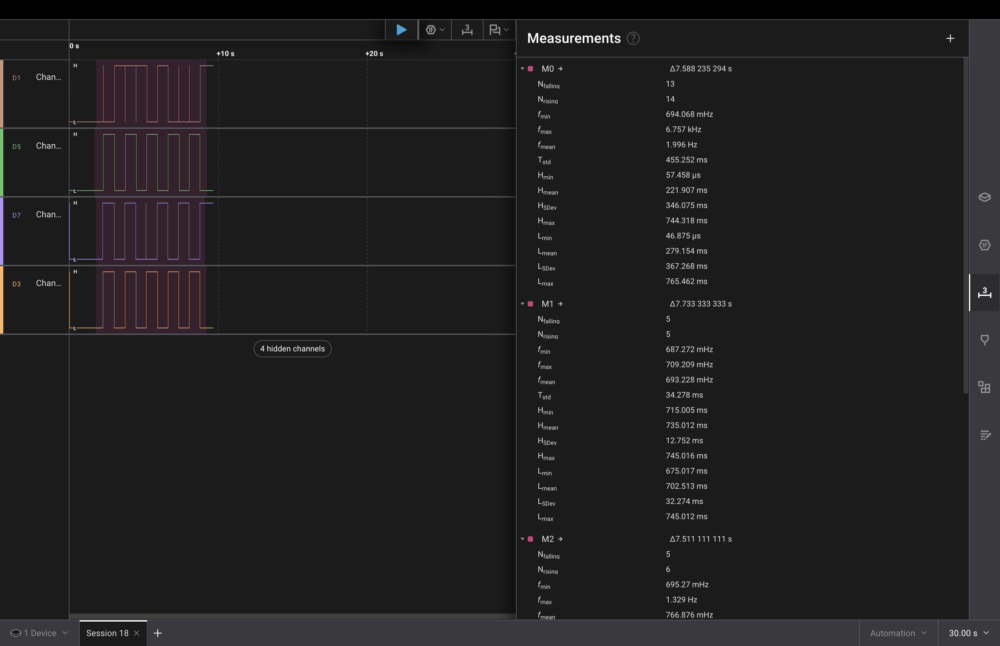
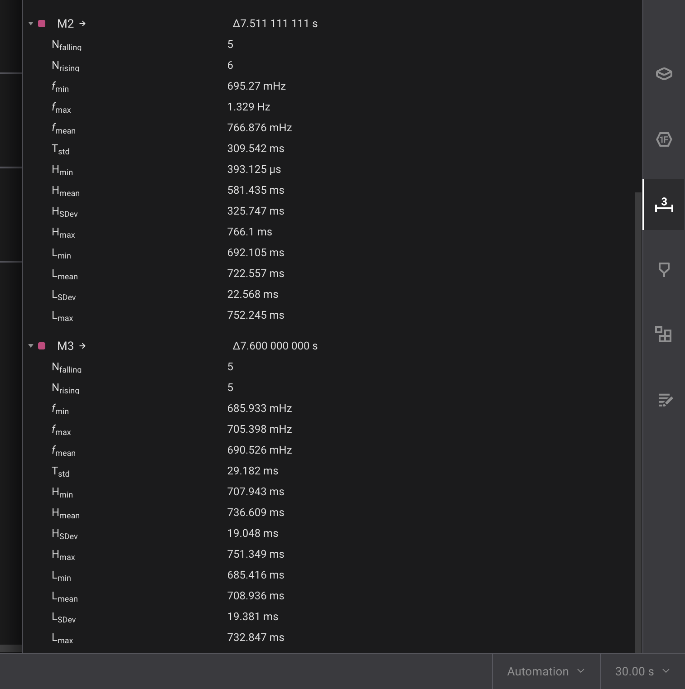

# esp32-playground

A bunch of learning projects using ESP32-S3-N16R8 developemt board.

- [User Guide](https://github.com/microrobotics/ESP32-S3-N16R8/blob/main/ESP32-S3-N16R8_User_Guide.pdf);
- [Schematic](https://99tech.com.au/mx-m/esp32/esp32-s3-yd_schematics.pdf);
- [ESP32-S3-WROOM-1 Datasheet](https://documentation.espressif.com/esp32-s3-wroom-1_wroom-1u_datasheet_en.pdf);
- [Pinout](https://lastminuteengineers.com/wp-content/uploads/iot/ESP32-S3-DevKitC-Pinout.png);

### Lesson 26: ESP IDF debounce experiments

### Fritzing

ESP32 ports 4-7 with internal pulldown listen to button presses. Pins 10-13 respectively are triggered as digital output on button presses, and we feed their output into logical analyzer.

### Task comments

Task 1:
`should_toggle_button_1` is set to `true` in GPIO input IRC, superloop polls for `should_toggle_button_1==true` and toggles output pin.

Task 2:

GPIO input ignores events that happened within the interval of 50ms, acts like task 1 otherwise.

Task 3:

`should_toggle_button_3` is set to `true` in GPIO input IRC, superloop polls for `should_toggle_button_3==true` and toggles output pin. Along the way, it also checks current pin state using `gpio_get_level`.

Task 4:

`update_btn_4_state` is an improvised state machine function, being called on every main loop iteration and checking btn state with respect to state variables and rules.

### Runtime behaviour

- D1 - task 1
- D3 - task 2
- D7 - task 3
- D5 - task 4

Each button was pressed 10 times. That means, ideally, we should have seen 5 rises and 5 falls, because button press triggers a toggle. Real results are provided below:

### Comparison

| Method | False positives                 | Latency                  | Complexity                                                                 | Comments                                             |
|--------|---------------------------------|--------------------------|----------------------------------------------------------------------------|------------------------------------------------------|
| Task 1 | 27 events for 10 actual toggles | Negligible               | Low                                          | Not usable for real projects                         |
| Task 2 | 10 events for 10 actual toggles | 50ms for software signal filtering | Low-to-medium                                                              | Usable for real projects |
| Task 3 | 11 events for 10 actual toggles | Negligible               | Low | Should be usable for real projects after fine-tuning |
| Task 4 | 10 events for 10 toggles        | 50ms                     | Medium                                                                     | Usable for real projects                             |
