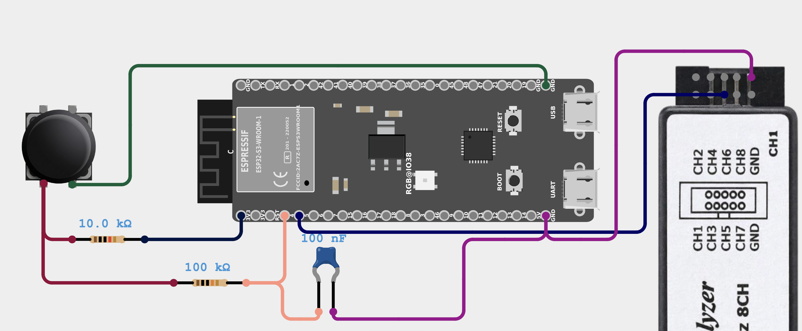
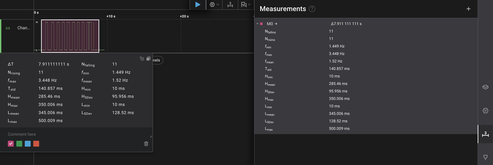

# esp32-playground

A bunch of learning projects using ESP32-S3-N16R8 developemt board.

- [User Guide](https://github.com/microrobotics/ESP32-S3-N16R8/blob/main/ESP32-S3-N16R8_User_Guide.pdf);
- [Schematic](https://99tech.com.au/mx-m/esp32/esp32-s3-yd_schematics.pdf);
- [ESP32-S3-WROOM-1 Datasheet](https://documentation.espressif.com/esp32-s3-wroom-1_wroom-1u_datasheet_en.pdf);
- [Pinout](https://lastminuteengineers.com/wp-content/uploads/iot/ESP32-S3-DevKitC-Pinout.png);

### Lesson 26: ESP IDF debounce experiments (part 2 - hardware debounce)

### Fritzing

### Runtime behaviour

Because of the specifics of hardware debounce (only active-LOW), I could not replicate the tasks using a hardware debounce - so I wrute some one-off code with simple toggle with a hardware debounce. Here are the measurement results:

Out of 10 real presses, serial monitor saw 11 toggles.

As a colclusion, I would say this approach is probably not flexible enough to be a drop-in replacement for software debounce, and has to be accompanied by one. The latency/delay can be calculated by capacitance*resistance and can be fine-tuned, but it feels like in much cases you can just use software debounce with ~50ms latency and it will work.