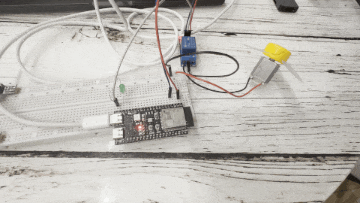

# esp32-playground

A bunch of learning projects using ESP32-S3-N16R8 developemt board.

- [User Guide](https://github.com/microrobotics/ESP32-S3-N16R8/blob/main/ESP32-S3-N16R8_User_Guide.pdf);
- [Schematic](https://99tech.com.au/mx-m/esp32/esp32-s3-yd_schematics.pdf);
- [ESP32-S3-WROOM-1 Datasheet](https://documentation.espressif.com/esp32-s3-wroom-1_wroom-1u_datasheet_en.pdf);
- [Pinout](https://lastminuteengineers.com/wp-content/uploads/iot/ESP32-S3-DevKitC-Pinout.png);

## Lesson 15

### Task
- Connect two LEDs to any GPIO outputs of the ESP32.
- Connect an external button to the GPIO.
- Use the BOOT button (GPIO0) as a second button without additional connections.
- Implement two LED blinking modes:
  - mode activated by an external button;
  - mode activated by the BOOT button.
- When pressing the external button, switch the LEDs to a faster blinking mode.
- When pressing the BOOT button, switch the LEDs to a slower blinking mode.
- Implement blinking via delay() (I have used millis()-based solution to avoid blocks and stutters).
- Eliminate the rattling of the button contacts (delay after the button is pressed).*
2. Additional (optional):
- Add a third mode that is activated by a long press of the button or by pressing both buttons simultaneously (I have implemented a gradual accelaration mode).
- Instead of two modes, implement cyclic switching between three or more speeds.
- Add output to Serial Monitor with a message about the selected mode.

