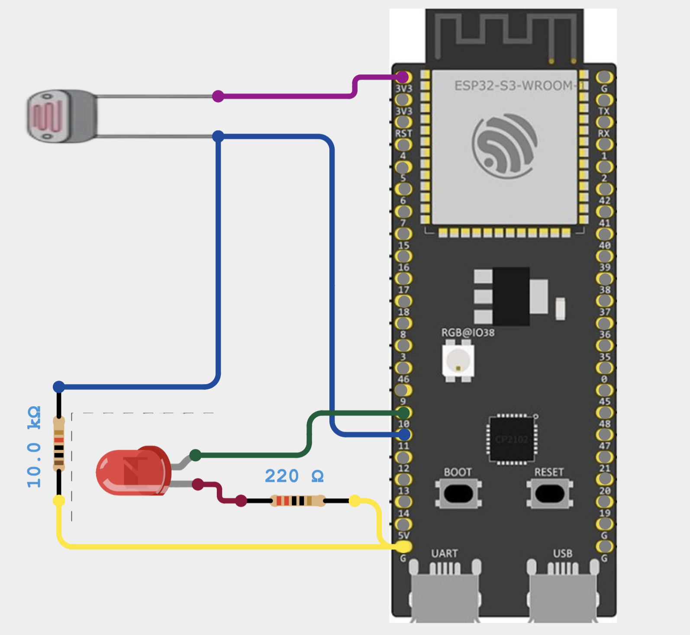
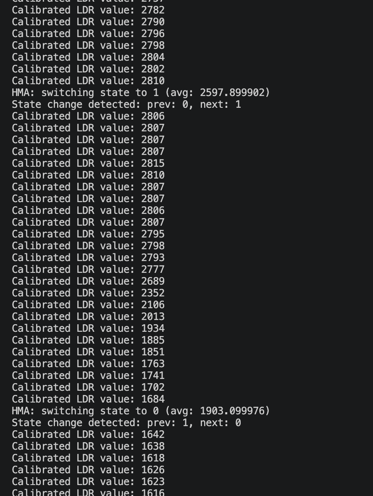
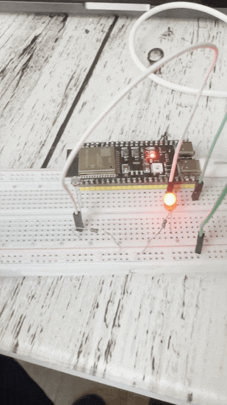

# esp32-playground

A bunch of learning projects using ESP32-S3-N16R8 developemt board.

- [User Guide](https://github.com/microrobotics/ESP32-S3-N16R8/blob/main/ESP32-S3-N16R8_User_Guide.pdf);
- [Schematic](https://99tech.com.au/mx-m/esp32/esp32-s3-yd_schematics.pdf);
- [ESP32-S3-WROOM-1 Datasheet](https://documentation.espressif.com/esp32-s3-wroom-1_wroom-1u_datasheet_en.pdf);
- [Pinout](https://lastminuteengineers.com/wp-content/uploads/iot/ESP32-S3-DevKitC-Pinout.png);

### Lesson 31: ADC data reader with sliding windw filtration

Read illumination value through voltage divider and LDR, feed them into MCU using calibrated ADC. We don't apply new value outright, but instead filter out the noise using custom sliding window algorithm.

### Code structure

- `main.c` is kept as light as it can be, it just calls logic implemented in other modules;
- `adc.h` initialises ADC driver and lets us get values in a superloop;
- `hysteresis_moving_average.h` contains a sliding window filteration. It uses a structure to store data - current state, window value and some parameters. To prevent inefficient memory usage, we initialize a fixed-size array for values, filling it using (i + 1) % WINDOW_SIZE approach;

### Fritzing

### Runtime behaviour

### Demo

